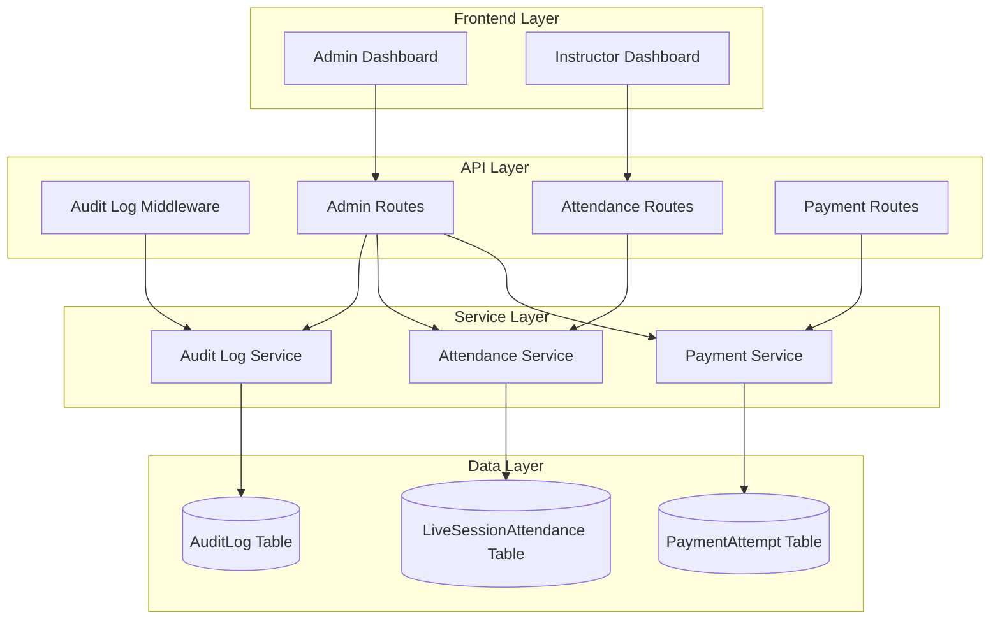
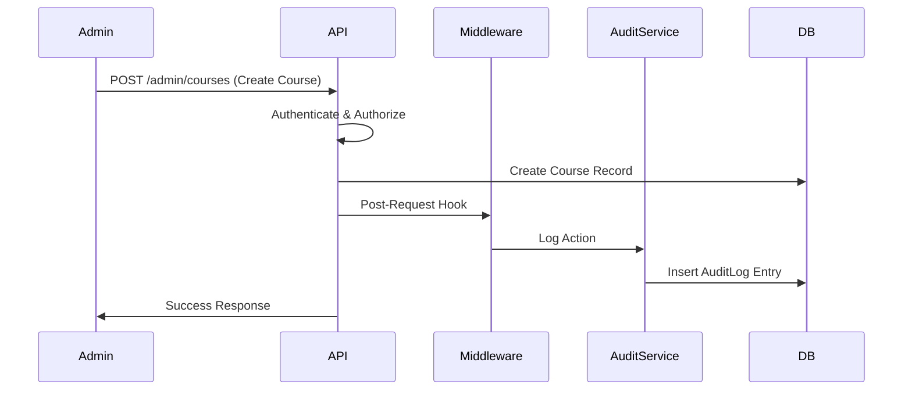
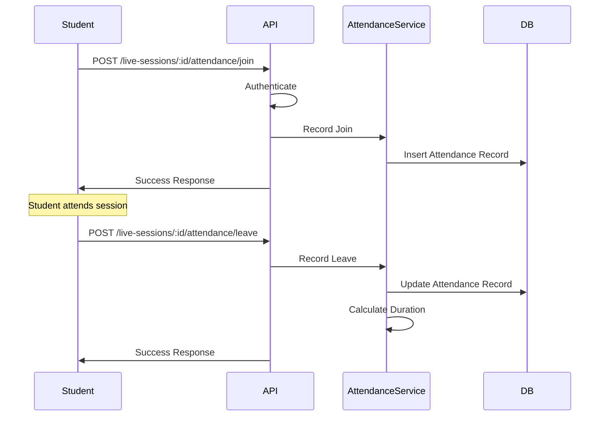
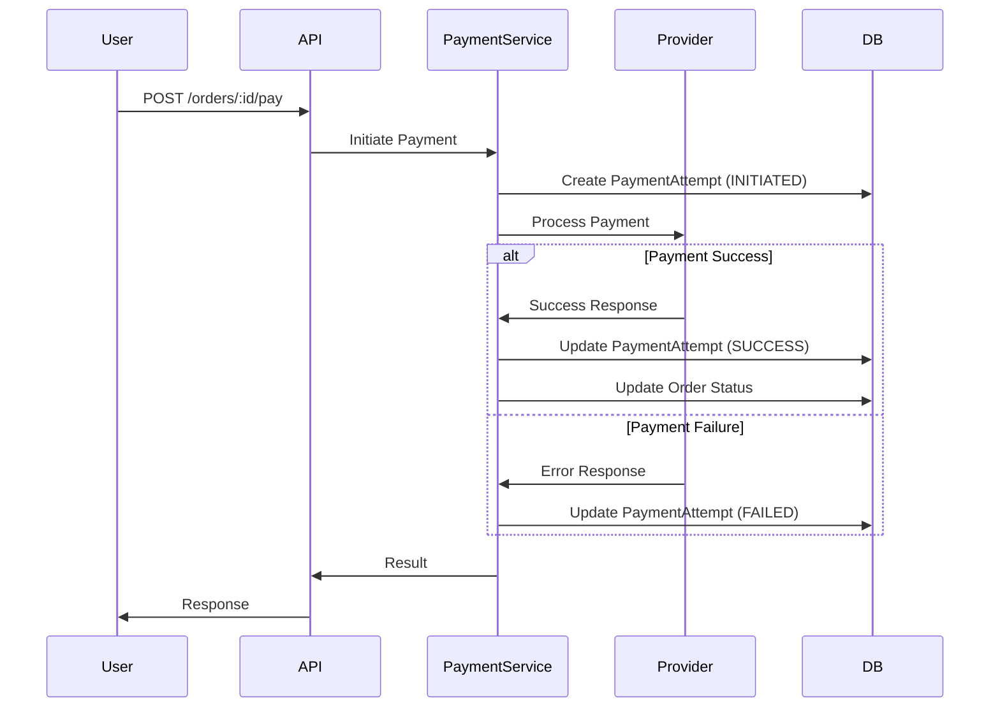

# Design Document: Phase 1 Database Analytics Tracking

## Overview

This design document specifies the technical implementation for Phase 1 of the database analytics audit system for The Colonel's Academy LMS. The implementation adds three critical tracking capabilities:

1. **Audit Logging** - Comprehensive tracking of all administrative actions with complete context
2. **Live Session Attendance** - Real-time tracking of student participation in live classes
3. **Payment Failure Tracking** - Detailed logging of all payment attempts including failures

### Goals

- Provide complete audit trail for compliance and security
- Enable data-driven insights into student engagement
- Reduce payment failures through detailed failure analysis
- Maintain high performance with minimal overhead
- Integrate seamlessly with existing Fastify API and Next.js frontend

### Non-Goals

- Real-time analytics dashboards (Phase 2)
- Advanced data visualization (Phase 2)
- Automated alerting systems (Phase 2)
- Historical data migration from Firestore
- Machine learning-based analytics

## Architecture

### System Components



### Data Flow

#### Audit Logging Flow



#### Attendance Tracking Flow



#### Payment Tracking Flow



## Components and Interfaces

### Database Schema

#### AuditLog Table

```prisma
model AuditLog {
  id           String   @id @default(cuid())
  userId       String
  action       String   // CREATE, UPDATE, DELETE, ROLE_CHANGE
  resourceType String   // Course, Lesson, Module, User, etc.
  resourceId   String
  changes      Json     // { before: {...}, after: {...} }
  ipAddress    String?
  userAgent    String?
  createdAt    DateTime @default(now())
  
  user User @relation(fields: [userId], references: [id], onDelete: Cascade)
  
  @@index([userId, createdAt(sort: Desc)])
  @@index([resourceType, resourceId])
  @@index([action])
  @@index([createdAt(sort: Desc)])
}
```

**Design Decisions:**
- `changes` field uses JSON to store flexible before/after state
- Separate indexes for common query patterns (user history, resource history, action type)
- Cascade delete on user to maintain referential integrity
- `ipAddress` and `userAgent` nullable for backward compatibility

#### LiveSessionAttendance Table

```prisma
model LiveSessionAttendance {
  id              String    @id @default(cuid())
  sessionId       String
  userId          String
  joinedAt        DateTime  @default(now())
  leftAt          DateTime?
  durationMinutes Int?
  createdAt       DateTime  @default(now())
  updatedAt       DateTime  @updatedAt
  
  session LiveSession @relation(fields: [sessionId], references: [id], onDelete: Cascade)
  user    User        @relation(fields: [userId], references: [id], onDelete: Cascade)
  
  @@index([sessionId])
  @@index([userId, joinedAt(sort: Desc)])
  @@index([sessionId, userId])
}
```

**Design Decisions:**
- Allows multiple records per user per session (rejoin scenarios)
- `leftAt` nullable to support ongoing sessions
- `durationMinutes` calculated and stored for query performance
- Cascade delete on session and user

#### PaymentAttempt Table

```prisma
enum PaymentAttemptStatus {
  INITIATED
  SUCCESS
  FAILED
}

model PaymentAttempt {
  id                 String               @id @default(cuid())
  orderId            String?
  chapterPurchaseId  String?
  bundlePurchaseId   String?
  userId             String
  amount             Int                  // NPR
  provider           String               // esewa, khalti, bank_transfer
  status             PaymentAttemptStatus @default(INITIATED)
  errorCode          String?
  errorMessage       String?
  transactionId      String?
  attemptedAt        DateTime             @default(now())
  
  user            User             @relation(fields: [userId], references: [id], onDelete: Cascade)
  order           PurchaseOrder?   @relation(fields: [orderId], references: [id], onDelete: SetNull)
  chapterPurchase ChapterPurchase? @relation(fields: [chapterPurchaseId], references: [id], onDelete: SetNull)
  bundlePurchase  BundlePurchase?  @relation(fields: [bundlePurchaseId], references: [id], onDelete: SetNull)
  
  @@index([userId, attemptedAt(sort: Desc)])
  @@index([orderId])
  @@index([chapterPurchaseId])
  @@index([bundlePurchaseId])
  @@index([status])
  @@index([provider])
  @@index([attemptedAt(sort: Desc)])
}
```

**Design Decisions:**
- Supports three purchase types: orders, chapter purchases, bundle purchases
- All purchase references nullable to support orphaned attempts
- SetNull on delete to preserve payment history
- Separate indexes for each query pattern
- `errorCode` and `errorMessage` for detailed failure analysis

### API Endpoints

#### Audit Log Endpoints

**GET /v1/admin/audit-logs**

Query Parameters:
```typescript
interface AuditLogQueryParams {
  page?: number;           // Default: 1
  limit?: number;          // Default: 50, Max: 100
  userId?: string;
  resourceType?: string;
  resourceId?: string;
  action?: string;
  startDate?: string;      // ISO 8601
  endDate?: string;        // ISO 8601
}
```

Response:
```typescript
interface AuditLogResponse {
  logs: Array<{
    id: string;
    userId: string;
    userName: string;
    userEmail: string;
    action: string;
    resourceType: string;
    resourceId: string;
    changes: {
      before?: Record<string, unknown>;
      after?: Record<string, unknown>;
    };
    ipAddress: string | null;
    userAgent: string | null;
    createdAt: string;
  }>;
  pagination: {
    page: number;
    limit: number;
    total: number;
    totalPages: number;
  };
}
```

**GET /v1/admin/audit-logs/stats**

Response:
```typescript
interface AuditLogStatsResponse {
  totalEntries: number;
  byAction: Record<string, number>;
  byResourceType: Record<string, number>;
  byUser: Array<{
    userId: string;
    userName: string;
    count: number;
  }>;
  dateRange: {
    earliest: string;
    latest: string;
  };
}
```

#### Attendance Endpoints

**POST /v1/live-sessions/:sessionId/attendance/join**

Request Body: None (user from auth context)

Response:
```typescript
interface AttendanceJoinResponse {
  attendanceId: string;
  sessionId: string;
  userId: string;
  joinedAt: string;
}
```

**POST /v1/live-sessions/:sessionId/attendance/leave**

Request Body: None (user from auth context)

Response:
```typescript
interface AttendanceLeaveResponse {
  attendanceId: string;
  sessionId: string;
  userId: string;
  joinedAt: string;
  leftAt: string;
  durationMinutes: number;
}
```

**GET /v1/live-sessions/:sessionId/attendance**

Query Parameters:
```typescript
interface AttendanceQueryParams {
  includeActive?: boolean; // Include users still in session
}
```

Response:
```typescript
interface SessionAttendanceResponse {
  sessionId: string;
  sessionTitle: string;
  attendees: Array<{
    userId: string;
    userName: string;
    userEmail: string;
    records: Array<{
      id: string;
      joinedAt: string;
      leftAt: string | null;
      durationMinutes: number | null;
    }>;
    totalDurationMinutes: number;
    isCurrentlyAttending: boolean;
  }>;
  stats: {
    totalAttendees: number;
    currentlyAttending: number;
    averageDurationMinutes: number;
  };
}
```

**GET /v1/admin/attendance/stats**

Query Parameters:
```typescript
interface AttendanceStatsQueryParams {
  courseId?: string;
  startDate?: string;
  endDate?: string;
}
```

Response:
```typescript
interface AttendanceStatsResponse {
  totalSessions: number;
  totalAttendees: number;
  averageAttendeesPerSession: number;
  averageDurationMinutes: number;
  attendanceRate: number; // Percentage of enrolled students
  byCourse: Array<{
    courseId: string;
    courseTitle: string;
    sessionCount: number;
    averageAttendees: number;
  }>;
}
```

#### Payment Analytics Endpoints

**GET /v1/admin/payments/attempts**

Query Parameters:
```typescript
interface PaymentAttemptsQueryParams {
  page?: number;
  limit?: number;
  status?: 'INITIATED' | 'SUCCESS' | 'FAILED';
  provider?: string;
  userId?: string;
  startDate?: string;
  endDate?: string;
}
```

Response:
```typescript
interface PaymentAttemptsResponse {
  attempts: Array<{
    id: string;
    userId: string;
    userName: string;
    userEmail: string;
    amount: number;
    provider: string;
    status: string;
    errorCode: string | null;
    errorMessage: string | null;
    transactionId: string | null;
    attemptedAt: string;
    orderType: 'order' | 'chapter' | 'bundle' | null;
    orderId: string | null;
  }>;
  pagination: {
    page: number;
    limit: number;
    total: number;
    totalPages: number;
  };
}
```

**GET /v1/admin/payments/stats**

Query Parameters:
```typescript
interface PaymentStatsQueryParams {
  startDate?: string;
  endDate?: string;
  provider?: string;
}
```

Response:
```typescript
interface PaymentStatsResponse {
  totalAttempts: number;
  byStatus: {
    initiated: number;
    success: number;
    failed: number;
  };
  byProvider: Record<string, {
    total: number;
    success: number;
    failed: number;
    successRate: number;
  }>;
  successRate: number;
  totalSuccessAmount: number;
  totalFailedAmount: number;
  commonErrors: Array<{
    errorCode: string;
    count: number;
    percentage: number;
  }>;
  timeline: Array<{
    date: string;
    success: number;
    failed: number;
  }>;
}
```

### Middleware Design

#### Audit Log Middleware

```typescript
interface AuditLogOptions {
  action: string;           // CREATE, UPDATE, DELETE
  resourceType: string;     // Course, Lesson, Module, etc.
  getResourceId: (request: FastifyRequest) => string;
  getBeforeState?: (request: FastifyRequest) => Promise<Record<string, unknown> | null>;
  getAfterState?: (request: FastifyRequest, reply: FastifyReply) => Promise<Record<string, unknown> | null>;
}

function createAuditLogHook(options: AuditLogOptions) {
  return async (request: FastifyRequest, reply: FastifyReply) => {
    // Implementation details in next section
  };
}
```

**Usage Example:**

```typescript
// In admin routes
fastify.post('/courses', {
  onResponse: createAuditLogHook({
    action: 'CREATE',
    resourceType: 'Course',
    getResourceId: (request) => request.body.id,
    getAfterState: async (request) => request.body
  })
}, async (request, reply) => {
  // Route handler
});

fastify.patch('/courses/:id', {
  onResponse: createAuditLogHook({
    action: 'UPDATE',
    resourceType: 'Course',
    getResourceId: (request) => request.params.id,
    getBeforeState: async (request) => {
      return await fastify.prisma.course.findUnique({
        where: { id: request.params.id }
      });
    },
    getAfterState: async (request) => {
      return await fastify.prisma.course.findUnique({
        where: { id: request.params.id }
      });
    }
  })
}, async (request, reply) => {
  // Route handler
});
```

### Service Layer

#### Audit Log Service

```typescript
interface CreateAuditLogParams {
  userId: string;
  action: string;
  resourceType: string;
  resourceId: string;
  changes: {
    before?: Record<string, unknown>;
    after?: Record<string, unknown>;
  };
  ipAddress?: string;
  userAgent?: string;
}

class AuditLogService {
  async createLog(params: CreateAuditLogParams): Promise<void>;
  async queryLogs(filters: AuditLogQueryParams): Promise<AuditLogResponse>;
  async getStats(filters?: { startDate?: Date; endDate?: Date }): Promise<AuditLogStatsResponse>;
}
```

#### Attendance Service

```typescript
interface RecordJoinParams {
  sessionId: string;
  userId: string;
}

interface RecordLeaveParams {
  sessionId: string;
  userId: string;
}

class AttendanceService {
  async recordJoin(params: RecordJoinParams): Promise<LiveSessionAttendance>;
  async recordLeave(params: RecordLeaveParams): Promise<LiveSessionAttendance>;
  async getSessionAttendance(sessionId: string): Promise<SessionAttendanceResponse>;
  async getStats(filters?: AttendanceStatsQueryParams): Promise<AttendanceStatsResponse>;
  async calculateDuration(joinedAt: Date, leftAt: Date): number;
}
```

#### Payment Service

```typescript
interface CreatePaymentAttemptParams {
  userId: string;
  amount: number;
  provider: string;
  orderId?: string;
  chapterPurchaseId?: string;
  bundlePurchaseId?: string;
}

interface UpdatePaymentAttemptParams {
  attemptId: string;
  status: 'SUCCESS' | 'FAILED';
  transactionId?: string;
  errorCode?: string;
  errorMessage?: string;
}

class PaymentService {
  async createAttempt(params: CreatePaymentAttemptParams): Promise<PaymentAttempt>;
  async updateAttempt(params: UpdatePaymentAttemptParams): Promise<PaymentAttempt>;
  async queryAttempts(filters: PaymentAttemptsQueryParams): Promise<PaymentAttemptsResponse>;
  async getStats(filters?: PaymentStatsQueryParams): Promise<PaymentStatsResponse>;
}
```

## Data Models

### TypeScript Interfaces

```typescript
// Audit Log
interface AuditLog {
  id: string;
  userId: string;
  action: string;
  resourceType: string;
  resourceId: string;
  changes: {
    before?: Record<string, unknown>;
    after?: Record<string, unknown>;
  };
  ipAddress: string | null;
  userAgent: string | null;
  createdAt: Date;
}

// Live Session Attendance
interface LiveSessionAttendance {
  id: string;
  sessionId: string;
  userId: string;
  joinedAt: Date;
  leftAt: Date | null;
  durationMinutes: number | null;
  createdAt: Date;
  updatedAt: Date;
}

// Payment Attempt
interface PaymentAttempt {
  id: string;
  orderId: string | null;
  chapterPurchaseId: string | null;
  bundlePurchaseId: string | null;
  userId: string;
  amount: number;
  provider: string;
  status: 'INITIATED' | 'SUCCESS' | 'FAILED';
  errorCode: string | null;
  errorMessage: string | null;
  transactionId: string | null;
  attemptedAt: Date;
}
```

## Error Handling

### Error Types

```typescript
class AuditLogError extends Error {
  constructor(message: string, public cause?: Error) {
    super(message);
    this.name = 'AuditLogError';
  }
}

class AttendanceError extends Error {
  constructor(message: string, public cause?: Error) {
    super(message);
    this.name = 'AttendanceError';
  }
}

class PaymentTrackingError extends Error {
  constructor(message: string, public cause?: Error) {
    super(message);
    this.name = 'PaymentTrackingError';
  }
}
```

### Error Handling Strategy

1. **Audit Log Failures**: Non-blocking - log error but don't fail the original request
2. **Attendance Failures**: Blocking - return 500 error to client
3. **Payment Tracking Failures**: Blocking - return 500 error to client

```typescript
// Audit log middleware error handling
try {
  await auditLogService.createLog(params);
} catch (error) {
  fastify.log.error({ error, params }, 'Failed to create audit log');
  // Don't throw - allow request to succeed
}

// Attendance endpoint error handling
try {
  const attendance = await attendanceService.recordJoin(params);
  return reply.send(attendance);
} catch (error) {
  fastify.log.error({ error, params }, 'Failed to record attendance');
  throw fastify.httpErrors.internalServerError('Failed to record attendance');
}

// Payment tracking error handling
try {
  const attempt = await paymentService.createAttempt(params);
  return attempt;
} catch (error) {
  fastify.log.error({ error, params }, 'Failed to create payment attempt');
  throw new PaymentTrackingError('Failed to create payment attempt', error);
}
```

### Validation

```typescript
// Request validation schemas
const auditLogQuerySchema = {
  querystring: {
    type: 'object',
    properties: {
      page: { type: 'integer', minimum: 1 },
      limit: { type: 'integer', minimum: 1, maximum: 100 },
      userId: { type: 'string' },
      resourceType: { type: 'string' },
      resourceId: { type: 'string' },
      action: { type: 'string' },
      startDate: { type: 'string', format: 'date-time' },
      endDate: { type: 'string', format: 'date-time' }
    }
  }
};

const attendanceJoinSchema = {
  params: {
    type: 'object',
    required: ['sessionId'],
    properties: {
      sessionId: { type: 'string' }
    }
  }
};

const paymentAttemptsQuerySchema = {
  querystring: {
    type: 'object',
    properties: {
      page: { type: 'integer', minimum: 1 },
      limit: { type: 'integer', minimum: 1, maximum: 100 },
      status: { type: 'string', enum: ['INITIATED', 'SUCCESS', 'FAILED'] },
      provider: { type: 'string' },
      userId: { type: 'string' },
      startDate: { type: 'string', format: 'date-time' },
      endDate: { type: 'string', format: 'date-time' }
    }
  }
};
```

## Testing Strategy

### Testing Approach

This feature is primarily composed of:
- Database CRUD operations
- API endpoints with filtering and pagination
- Middleware for side-effect logging
- UI components for data visualization

**Property-based testing is NOT applicable** for this feature because:
1. Audit logging is a side-effect operation (logging actions, not transforming data)
2. Most functionality involves database I/O and external state
3. API endpoints are best tested with integration tests
4. UI components are best tested with snapshot tests

**Testing will focus on:**
- Unit tests for calculation logic (duration, stats aggregation)
- Integration tests for API endpoints
- Mock-based tests for middleware
- Example-based tests for edge cases

### Unit Tests

**Audit Log Service Tests:**
- Test log creation with all fields
- Test log creation with minimal fields
- Test query with various filters
- Test stats calculation
- Test error handling for database failures

**Attendance Service Tests:**
- Test join recording
- Test leave recording with duration calculation
- Test multiple join/leave cycles for same user
- Test concurrent attendance for multiple users
- Test duration calculation edge cases (same minute, midnight crossing)
- Test querying active sessions

**Payment Service Tests:**
- Test attempt creation for each purchase type
- Test attempt updates (success and failure)
- Test query with various filters
- Test stats calculation including success rates
- Test error aggregation

**Middleware Tests:**
- Test audit log hook with CREATE action
- Test audit log hook with UPDATE action (before/after state)
- Test audit log hook with DELETE action
- Test middleware error handling (non-blocking)
- Test IP address and user agent extraction

### Integration Tests

**API Endpoint Tests:**
- Test audit log endpoints with authentication
- Test audit log endpoints with authorization (admin only)
- Test attendance endpoints with authentication
- Test attendance endpoints with authorization (admin/instructor)
- Test payment analytics endpoints with authentication
- Test pagination for all list endpoints
- Test filtering for all list endpoints
- Test error responses (401, 403, 404, 500)

**Database Tests:**
- Test Prisma schema migrations
- Test index performance on large datasets
- Test cascade deletes
- Test concurrent writes

### Performance Tests

- Test audit log creation overhead (< 50ms)
- Test query performance with 100k+ audit logs
- Test attendance query performance with 10k+ records
- Test payment stats calculation with 50k+ attempts
- Test pagination performance

### Example Test Cases

```typescript
describe('AuditLogService', () => {
  it('should create audit log with complete data', async () => {
    const params = {
      userId: 'user123',
      action: 'CREATE',
      resourceType: 'Course',
      resourceId: 'course456',
      changes: { after: { title: 'New Course' } },
      ipAddress: '192.168.1.1',
      userAgent: 'Mozilla/5.0'
    };
    
    const log = await auditLogService.createLog(params);
    
    expect(log.userId).toBe(params.userId);
    expect(log.action).toBe(params.action);
    expect(log.resourceType).toBe(params.resourceType);
  });
  
  it('should query logs with filters', async () => {
    const result = await auditLogService.queryLogs({
      userId: 'user123',
      page: 1,
      limit: 50
    });
    
    expect(result.logs).toBeInstanceOf(Array);
    expect(result.pagination.page).toBe(1);
  });
});

describe('AttendanceService', () => {
  it('should record join and calculate duration on leave', async () => {
    const joinResult = await attendanceService.recordJoin({
      sessionId: 'session123',
      userId: 'user456'
    });
    
    expect(joinResult.joinedAt).toBeInstanceOf(Date);
    expect(joinResult.leftAt).toBeNull();
    
    // Wait 2 minutes
    await new Promise(resolve => setTimeout(resolve, 120000));
    
    const leaveResult = await attendanceService.recordLeave({
      sessionId: 'session123',
      userId: 'user456'
    });
    
    expect(leaveResult.leftAt).toBeInstanceOf(Date);
    expect(leaveResult.durationMinutes).toBe(2);
  });
});

describe('PaymentService', () => {
  it('should create and update payment attempt', async () => {
    const attempt = await paymentService.createAttempt({
      userId: 'user123',
      amount: 5000,
      provider: 'esewa',
      orderId: 'order456'
    });
    
    expect(attempt.status).toBe('INITIATED');
    
    const updated = await paymentService.updateAttempt({
      attemptId: attempt.id,
      status: 'SUCCESS',
      transactionId: 'txn789'
    });
    
    expect(updated.status).toBe('SUCCESS');
    expect(updated.transactionId).toBe('txn789');
  });
});
```

## Implementation Plan

### Phase 1: Database Schema (Week 1)

1. Create Prisma schema additions for three new tables
2. Generate and test migrations
3. Add relations to existing models
4. Verify indexes are created correctly

### Phase 2: Service Layer (Week 1-2)

1. Implement AuditLogService
2. Implement AttendanceService
3. Implement PaymentService
4. Write unit tests for all services

### Phase 3: API Endpoints (Week 2)

1. Implement audit log endpoints
2. Implement attendance endpoints
3. Implement payment analytics endpoints
4. Add request validation schemas
5. Write integration tests

### Phase 4: Middleware (Week 2-3)

1. Implement audit log middleware
2. Integrate middleware with existing admin routes
3. Test middleware with various route types
4. Add error handling and logging

### Phase 5: Frontend Components (Week 3-4)

1. Create audit log viewer page
2. Create attendance analytics page
3. Create payment analytics page
4. Add filtering and pagination UI
5. Add export functionality

### Phase 6: Testing & Documentation (Week 4)

1. Complete integration testing
2. Performance testing with large datasets
3. Update API documentation
4. Create admin user guide
5. Deploy to staging environment

## Deployment Considerations

### Database Migration

```bash
# Generate migration
npx prisma migrate dev --name add-analytics-tables

# Apply to staging
npx prisma migrate deploy

# Apply to production
npx prisma migrate deploy
```

### Environment Variables

No new environment variables required - uses existing database connection.

### Monitoring

- Add Sentry error tracking for audit log failures
- Add performance monitoring for analytics queries
- Set up alerts for high payment failure rates

### Rollback Plan

1. If issues detected, disable audit log middleware
2. Analytics endpoints can be disabled via feature flag
3. Database tables can remain (no data loss)
4. Rollback migration if schema issues detected

### Performance Optimization

- Implement query result caching for stats endpoints (5-minute TTL)
- Add database connection pooling for analytics queries
- Consider read replicas for heavy analytics workloads
- Implement query timeouts (30 seconds)

## Security Considerations

### Authentication & Authorization

- All admin endpoints require ADMIN role
- Attendance endpoints require ADMIN or INSTRUCTOR role
- Student attendance endpoints require authentication only
- Use existing Fastify auth plugin

### Data Privacy

- Audit logs contain sensitive user actions - restrict access
- Payment attempts contain financial data - encrypt at rest
- IP addresses are PII - handle according to privacy policy
- Implement data retention policies (e.g., 2 years)

### SQL Injection Prevention

- Use Prisma ORM for all database queries (parameterized)
- Validate all user inputs with JSON schemas
- Sanitize filter parameters

### Rate Limiting

- Apply existing rate limiting to new endpoints
- Consider stricter limits for export endpoints
- Implement pagination to prevent large data dumps

## Future Enhancements (Phase 2+)

1. **Real-time Analytics Dashboard**
   - WebSocket-based live updates
   - Real-time attendance tracking
   - Live payment success rate monitoring

2. **Advanced Visualizations**
   - Time-series charts for trends
   - Heatmaps for attendance patterns
   - Funnel analysis for payment flows

3. **Automated Alerting**
   - Email alerts for suspicious admin actions
   - Slack notifications for payment failures
   - Attendance drop alerts for instructors

4. **Data Export & Reporting**
   - Scheduled report generation
   - Custom report builder
   - PDF export functionality

5. **Machine Learning Integration**
   - Payment failure prediction
   - Attendance prediction
   - Anomaly detection for admin actions
