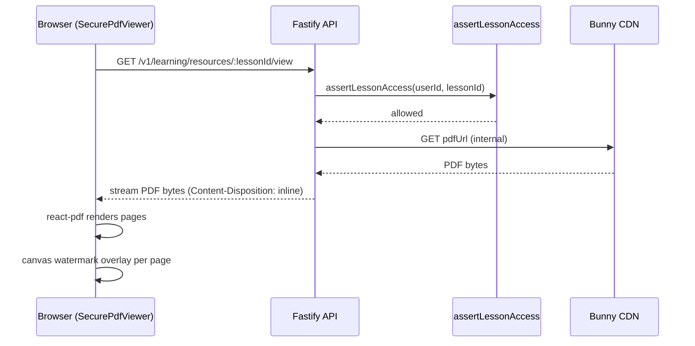

# Design Document: Secure Resource Delivery

## Overview

This feature replaces the current `ResourceLessonStage` "Open Resource" link with an inline secure PDF viewer that renders in the same position as the `VideoPlayer` inside the classroom. When a lesson has `contentType=PDF` or `learningMode=RESOURCE`, `LessonStageRenderer` routes to a new `SecurePdfViewer` component instead of `ResourceLessonStage`.

The API adds two endpoints under `/v1/learning/resources/:lessonId`:
- `GET /token` — verifies enrollment and returns a short-lived signed URL
- `GET /view` — proxies the PDF bytes through the API, hiding the CDN URL

The raw `pdfUrl` is stripped from lesson responses for non-admin users. The viewer renders pages with `react-pdf` and overlays a canvas watermark containing the user's identity on each page.

### Key Design Decisions

- **Proxy over signed URL in `<iframe>`**: The viewer calls `/view` (the proxy endpoint) rather than passing the signed URL directly to `react-pdf`. This keeps the CDN URL out of browser network traffic entirely.
- **Reuse `assertLessonAccess`**: Both endpoints call the existing `assertLessonAccess` guard — no new enrollment logic needed.
- **Canvas watermark**: Rendered client-side as a canvas overlay on each page, not embedded in the PDF bytes. This is simpler and sufficient for deterrence.
- **Token refresh**: The viewer tracks the token expiry and re-fetches before it expires, maintaining the current page number.
- **`hasResource` flag**: The catalog service adds `hasResource: true` to lesson responses when `pdfUrl` is set and the user is not admin/DS, replacing the raw URL.

---

## Architecture



The `/token` endpoint exists for future use (e.g., mobile clients that need a direct CDN URL). The web viewer uses `/view` exclusively.

---

## Components and Interfaces

### API: Resource Routes (`apps/api/src/modules/learning/routes.ts`)

Two new routes added to the existing `learningRoutes` plugin:

```typescript
// GET /v1/learning/resources/:lessonId/view
// Streams PDF bytes through the API after verifying enrollment.
// Headers: Content-Disposition: inline; filename="resource.pdf"
//          Cache-Control: no-store, no-cache
//          Content-Type: application/pdf

// GET /v1/learning/resources/:lessonId/token
// Returns a short-lived signed URL for the lesson's PDF asset.
// Response: { signedUrl: string, expiresAt: number }
```

Both routes:
1. Call `fastify.requireAuth(request)` to get the Firebase user
2. Look up the DB user by `firebaseUid`
3. Look up the lesson to get `courseId` and `pdfUrl`
4. Call `assertLessonAccess` with the existing guard
5. Return 404 if `pdfUrl` is null

### API: Signed URL Generation (`apps/api/src/lib/resource-signing.ts`)

```typescript
interface SignedUrlOptions {
  pdfUrl: string;       // full CDN URL or path
  ttlSeconds: number;   // default 60
  bunnyTokenKey: string; // from env: BUNNY_TOKEN_AUTH_KEY
}

interface SignedUrlResult {
  signedUrl: string;
  expiresAt: number; // Unix timestamp
}

function generateSignedUrl(opts: SignedUrlOptions): SignedUrlResult
```

Uses HMAC-SHA256 following Bunny CDN's token authentication spec:
- `expires = Math.floor(Date.now() / 1000) + ttlSeconds`
- `hashableBase = bunnyTokenKey + urlPath + expires`
- `token = base64url(sha256(hashableBase))`
- Final URL: `${baseUrl}?token=${token}&expires=${expires}`

### API: Catalog Service — `pdfUrl` suppression (`apps/api/src/modules/catalog/service.ts`)

In the `mapLesson` function, replace the unconditional `if (l.pdfUrl) lesson.pdfUrl = l.pdfUrl` with:

```typescript
if (l.pdfUrl) {
  if (isAdminOrDs) {
    lesson.pdfUrl = l.pdfUrl;
  } else {
    lesson.hasResource = true; // new field on LessonDetail
  }
}
```

### API: Audit Logging (`apps/api/src/lib/resource-audit.ts`)

```typescript
interface ResourceAccessEvent {
  userId: string;
  lessonId: string;
  courseId: string;
  ip: string;
  userAgent: string;
  accessedAt: Date;
  denied?: boolean;
  denialReason?: string;
}

async function recordResourceAccess(prisma: PrismaClient, event: ResourceAccessEvent): Promise<void>
async function checkAccessRateLimit(prisma: PrismaClient, userId: string, lessonId: string): Promise<boolean>
```

Stored in a new `ResourceAccessLog` Prisma model (see Data Models).

### Frontend: `SecurePdfViewer` (`apps/web/src/components/classroom/stages/SecurePdfViewer.tsx`)

```typescript
interface SecurePdfViewerProps {
  courseTitle: string;
  lesson: StageLesson; // existing type — has id, title, synopsis, hasResource, progressStatus
  onMarkComplete: () => void;
  progressBusy: boolean;
}
```

Internal state:
- `viewUrl: string | null` — the `/view` proxy URL (constructed from lessonId, not a signed URL)
- `numPages: number`
- `currentPage: number`
- `loading: boolean`
- `error: string | null`

The viewer calls `GET /v1/learning/resources/:lessonId/view` directly as the PDF source for `react-pdf`. Since the proxy re-validates enrollment on every request, no token management is needed on the frontend — the browser's auth cookie/header handles it.

Watermark is drawn on a `<canvas>` element absolutely positioned over each rendered page.

### Frontend: `LessonStageRenderer` update

Replace the `shouldUseResourceStage` branch:

```typescript
// Before:
if (shouldUseResourceStage) {
  return <ResourceLessonStage ... />;
}

// After:
if (shouldUseResourceStage) {
  return (
    <SecurePdfViewer
      courseTitle={courseTitle}
      lesson={lesson}
      onMarkComplete={onMarkComplete}
      progressBusy={progressBusy}
    />
  );
}
```

### Frontend: Classroom Page — remove `pdfUrl` from resources tab

The resources tab in `classroom/[slug]/page.tsx` currently links directly to `activeLesson.pdfUrl`. This link should be removed for non-admin users (the PDF is now viewed inline). The resources tab can show a "View PDF" button that scrolls to the lesson instead, or simply omit the direct link.

### Contracts: `LessonDetail` type update (`packages/contracts`)

```typescript
interface LessonDetail {
  // ... existing fields ...
  pdfUrl?: string;       // only present for ADMIN/DS
  hasResource?: boolean; // true when lesson has a PDF and user is not admin
}
```

---

## Data Models

### New Prisma model: `ResourceAccessLog`

```prisma
model ResourceAccessLog {
  id           String   @id @default(cuid())
  userId       String?
  lessonId     String
  courseId     String
  ip           String
  userAgent    String
  denied       Boolean  @default(false)
  denialReason String?
  accessedAt   DateTime @default(now())

  @@index([userId, lessonId, accessedAt])
  @@index([lessonId, accessedAt])
}
```

No foreign key constraints — audit logs should survive lesson/user deletion.

### Environment variables

```
BUNNY_TOKEN_AUTH_KEY=<from Bunny CDN dashboard>
BUNNY_CDN_BASE_URL=https://your-zone.b-cdn.net
RESOURCE_TOKEN_TTL_SECONDS=60
```

---

## Correctness Properties

*A property is a characteristic or behavior that should hold true across all valid executions of a system — essentially, a formal statement about what the system should do. Properties serve as the bridge between human-readable specifications and machine-verifiable correctness guarantees.*

### Property 1: Signed URL path scoping

*For any* two distinct file paths, a signed URL generated for path A shall fail HMAC verification when checked against path B.

**Validates: Requirements 1.5**

### Property 2: Signed URL expiry correctness

*For any* TTL value between 1 and 3600 seconds, the expiry timestamp embedded in the generated signed URL shall equal `floor(now/1000) + ttl` (within a 1-second tolerance for execution time).

**Validates: Requirements 1.4**

### Property 3: pdfUrl suppression for non-admin users

*For any* lesson with a non-null `pdfUrl` and any user with role STUDENT, the `mapLesson` function shall return a `LessonDetail` where `pdfUrl` is undefined and `hasResource` is `true`.

**Validates: Requirements 2.1, 2.2**

### Property 4: pdfUrl preserved for admin/DS users

*For any* lesson with a non-null `pdfUrl` and any user with role ADMIN or DS, the `mapLesson` function shall return a `LessonDetail` where `pdfUrl` equals the original value.

**Validates: Requirements 2.4**

### Property 5: LessonStageRenderer routes PDF lessons to SecurePdfViewer

*For any* lesson where `contentType === "PDF"` or `learningMode === "RESOURCE"`, `LessonStageRenderer` shall render `SecurePdfViewer` and not `ResourceLessonStage` or `VideoPlayer`.

**Validates: Requirements 3.1, 7.1**

### Property 6: Watermark contains user identity

*For any* user (displayName, email, or UID as fallback) and any page canvas dimensions, the `drawWatermark` function shall produce a canvas that contains the user's identifying text.

**Validates: Requirements 4.1, 4.5**

### Property 7: Watermark opacity invariant

*For any* user data and page dimensions, the `drawWatermark` function shall set `globalAlpha` to a value between 0.08 and 0.15 inclusive.

**Validates: Requirements 4.2**

### Property 8: Proxy response headers invariant

*For any* successful proxy response from `/view`, the response shall always include `Content-Disposition: inline; filename="resource.pdf"` and `Cache-Control: no-store, no-cache`.

**Validates: Requirements 5.2, 5.3**

### Property 9: Mark-complete independence from PDF state

*For any* PDF viewing state (loading, error, page N), the `onMarkComplete` callback shall be invokable and the mark-complete button shall not be disabled due to PDF state.

**Validates: Requirements 7.4**

### Property 10: Lesson title and synopsis always rendered

*For any* lesson with a title and synopsis, `SecurePdfViewer` shall render both values in its output regardless of PDF loading state.

**Validates: Requirements 7.5**

---

## Error Handling

| Scenario | API Response | Frontend Behaviour |
|---|---|---|
| User not enrolled | 403 Forbidden | SecurePdfViewer shows "Access denied" with enroll CTA |
| Lesson has no pdfUrl | 404 Not Found | SecurePdfViewer shows "Resource Pending" state |
| Bunny CDN unreachable | 502 Bad Gateway | SecurePdfViewer shows error + retry button |
| Response > 50 MB | 413 Payload Too Large | SecurePdfViewer shows error message |
| Network error on fetch | — | SecurePdfViewer shows error + retry button |
| User not authenticated | 401 Unauthorized | Redirect to login |

---

## Testing Strategy

### Unit Tests

- `generateSignedUrl`: test path scoping, expiry calculation, HMAC correctness
- `mapLesson` (catalog service): test pdfUrl suppression for STUDENT, preservation for ADMIN/DS
- `drawWatermark`: test opacity range, rotation angle, text content
- `SecurePdfViewer`: test loading state, error state, "Resource Pending" state, mark-complete independence
- `LessonStageRenderer`: test routing to SecurePdfViewer for PDF/RESOURCE lessons

### Property-Based Tests

Using [fast-check](https://github.com/dubzzz/fast-check) (TypeScript, already compatible with the Vitest setup).

Each property test runs a minimum of 100 iterations.

- **Property 1** — `fc.tuple(fc.string(), fc.string()).filter(([a, b]) => a !== b)` → verify cross-path token rejection
- **Property 2** — `fc.integer({ min: 1, max: 3600 })` → verify expiry = now + ttl
- **Property 3** — `fc.record({ pdfUrl: fc.string(), ...lessonFields })` with STUDENT role → verify hasResource=true, no pdfUrl
- **Property 4** — same generator with ADMIN/DS role → verify pdfUrl preserved
- **Property 5** — `fc.oneof(fc.constant("PDF"), fc.constant("RESOURCE"))` as contentType/learningMode → verify SecurePdfViewer rendered
- **Property 6** — `fc.record({ displayName: fc.option(fc.string()), email: fc.option(fc.string()), uid: fc.string() })` → verify canvas text contains identity
- **Property 7** — same generator → verify globalAlpha in [0.08, 0.15]
- **Property 8** — `fc.string()` as lessonId with enrolled user → verify response headers
- **Property 9** — `fc.oneof(fc.constant("loading"), fc.constant("error"), fc.integer({ min: 1, max: 100 }))` as viewer state → verify onMarkComplete callable
- **Property 10** — `fc.record({ title: fc.string({ minLength: 1 }), synopsis: fc.string({ minLength: 1 }) })` → verify both appear in rendered output

Tag format: `// Feature: secure-resource-delivery, Property N: <property text>`

### Integration Tests

- `GET /v1/learning/resources/:lessonId/view` with enrolled user → 200 + correct headers
- `GET /v1/learning/resources/:lessonId/view` with non-enrolled user → 403
- `GET /v1/learning/resources/:lessonId/token` with enrolled user → 200 + signedUrl
- `GET /v1/learning/resources/:lessonId/token` for lesson with no pdfUrl → 404
- Audit log records created on access and denial
